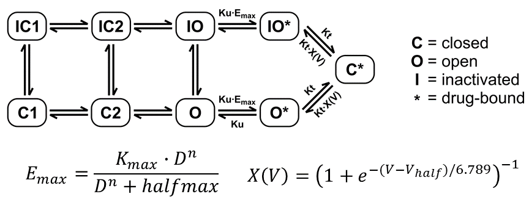

# Uncertainty characterization of drug-hERG kinetics
This code performs uncertainty characterization for the pharmacological component of the human Ether-à-go-go-Related Gene (hERG) current model using the nonparametric bootstrap method.

## Proviso
This code is exactly the same as it was before from our previous paper, but now data for all 28 drugs are provided.

## hERG model
The hERG Markov model includes a saturating drug binding component and a drug trapping component:



The fitted drug parameters are Ku (drug unbinding rate), Kmax (maximum drug effect), n (Hill coefficient of drug binding), halfmax (nth power of the half-maximal drug concentration), and Vhalf (drug trapping potential).

## Running the code
This code uses the following R packages: optparse (version 1.4.4), deSolve (version 1.14), ggplot2 (version 2.2.0), cmaes (version 1.0-11), and FME (version 1.3.5).

Results and figures are automatically saved to [results/](results/) and [figs/](figs/), respectively.

A quick example of the bootstrapping process can be run with [this bash script](run_example.sh) to ensure the code is working. The full process is explained below.

### Bootstrapping the data
Drug parameters are fit to fractional block time series data obtained using the Milnes protocol (Milnes *et al.* 2010, Li *et al.* 2017). The data are located in [data/](data/) in CSV format (see [README.md](data/README.md) for details).

Before fitting the model, bootstrap samples must first be generated from the data using the following command:

```
Rscript generate_bootstrap_samples.R
```

The default is to generate 2000 bootstrap samples for each of the 12 CiPA training drugs. Different drugs and/or a different number of samples can be specified:

```
Rscript generate_bootstrap_samples.R -d "drug1,drug2" -n 3000
```

The random bootstrap sampling will be reproducible as long as the drugs are specified in the same order. Note that for new drugs, the relevant data files should be located in [data/](data/) (e.g. data/drug1.csv, data/drug2.csv).

The random seed (default 100) can also be changed:

```
Rscript generate_bootstrap_samples.R -d "drug1,drug2" -s 200
```

### Fitting the model
The dynamic hERG model C code is provided in [models/](models/) and must be compiled:

```
cd models
R CMD SHLIB hergmod.c
```

Fitting is performed with the Covariance Matrix Adaptation Evolutionary Strategy (CMA-ES) (Hansen *et al.* 2006). Non-default hyperparameters for CMA-ES are used (population size of 80, stopping tolerance of 0.001). After compiling the model, the optimal model parameters must be fitted prior to fitting the bootstrap samples:

```
Rscript hERG_fitting.R -d bepridil -l 80 -t 0.001
```

Once the optimal model fitting is done, bootstrap samples (1-2000) can be fitted:

```
Rscript hERG_fitting.R -d bepridil -i "1-2000" -l 80 -t 0.001
```

Note that the bootstrap fitting is computationally intensive, and it is recommended that this be done in parallel on a high-performance computing resource. (See [this script](run_hERG_boot_fit.sh) for an example of how to split up the bootstraps.)

### Postprocessing
After bootstrap fitting is finished, results can be combined, summarized, and plotted (note that this command must be run in order to generate inputs for [uncertainty propagation](../AP_simulation/)):

```
Rscript process_boot_results.R -d bepridil
```

To perform sensitivity analysis using bootstrapping results, run:

```
Rscript Milnes_sensitivity.R -d bepridil
```

## References
* Hansen, N. (2006). "The CMA Evolution Strategy: A Comparing Review," in Towards a New Evolutionary Computation: Advances in the Estimation of Distribution Algorithms, eds. J.A. Lozano, P. Larrañaga, I. Inza & E. Bengoetxea.  (Berlin, Heidelberg: Springer Berlin Heidelberg), 75-102.
* Li, Z., Dutta, S., Sheng, J., Tran, P.N., Wu, W., Chang, K., et al. (2017). Improving the In Silico Assessment of Proarrhythmia Risk by Combining hERG (Human Ether-à-go-go-Related Gene) ChannelDrug Binding Kinetics and Multichannel Pharmacology. Circulation: Arrhythmia and Electrophysiology 10(2), e004628. doi: 10.1161/circep.116.004628.
* Milnes, J.T., Witchel, H.J., Leaney, J.L., Leishman, D.J., and Hancox, J.C. (2010). Investigating dynamic protocol-dependence of hERG potassium channel inhibition at 37 degrees C: Cisapride versus dofetilide. J Pharmacol Toxicol Methods 61(2), 178-191. doi: 10.1016/j.vascn.2010.02.007.
* many thanks also to Min Wu and Aaron Randolph for experimental contributions.